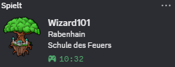
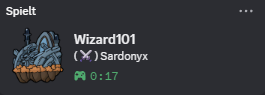
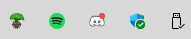

# wizard101rpc 

 

Discord Rich Presence Tool für Wizard101.  
Zeigt automatisch dein aktuelles Gebiet, Kampfstatus und deine Spielzeit an.

## 👀 Vorschau

| Erkunden | Kampf |
|---------|-------|
|  |  |

## ✨ Funktionen

- Anzeige von Gebiet und Welt
- Kampferkennung (⚔️)
- Anzeige der Charakterauswahl  
 

- Autostart (optional)
- Meldung unbekannter Gebiete (optional)

---

## 📥 Download & Nutzung

1. Lade die aktuelle Version aus dem Bereich **Releases** herunter
2. Starte `wizard101rpc.exe`
3. Verwaltung über das System-Tray  

### Manuelle Pfadauswahl (optional)

Sollte Wizard101 nicht im Standardverzeichnis installiert sein, kann wizard101rpc das Spiel nicht automatisch erkennen.

In diesem Fall wähle im System-Tray die Option  
**„Pfad manuell auswählen“** und navigiere zum Installationsverzeichnis von Wizard101.  
Wähle dort die Datei **`Wiz.ico`** aus.

Nach dem Setzen des Pfades startet sich wizard101rpc automatisch neu.

### App-Datenverzeichnis

Je nach Nutzung wird automatisch ein Verzeichnis unter  
**`%APPDATA%\wizard101rpc`** angelegt.

Darin speichert die Anwendung:
- eine Konfigurationsdatei
- ein Logfile, falls unbekannte Gebiete erkannt werden

---
## 🛡️ Hinweis zu Windows Defender

Diese Anwendung ist **nicht signiert**.  
Beim ersten Start kann Windows SmartScreen oder Windows Defender eine Warnung anzeigen.

Dies ist ein bekanntes False-Positive bei Tools, die:
- im Hintergrund laufen
- Autostart anbieten

Wähle **„Weitere Informationen“ → „Trotzdem ausführen“**.

Der vollständige Quellcode ist in diesem Repository einsehbar.

## 🔒 Datenschutz

- Es werden **keine Daten gesammelt oder übertragen**
- Es werden **keine Accounts** benötigt
- Es findet **keine Netzwerkkommunikation** statt  
  (ausgenommen lokale Kommunikation mit Discord)
- Alle Daten werden **lokal auf deinem PC verarbeitet**

## 🖥️ Unterstützte Plattformen

- Windows
---
## 🤝 Mitwirken

Beiträge sind willkommen – egal ob Bugfixes, Feature-Ideen oder neue Gebietsübersetzungen.

👉 Details zur Mitarbeit findest du [hier](CONTRIBUTING.md).

## 📄 Lizenz

MIT License

> Dieses Projekt steht in keiner Verbindung zu KingsIsle Entertainment oder Wizard101.
