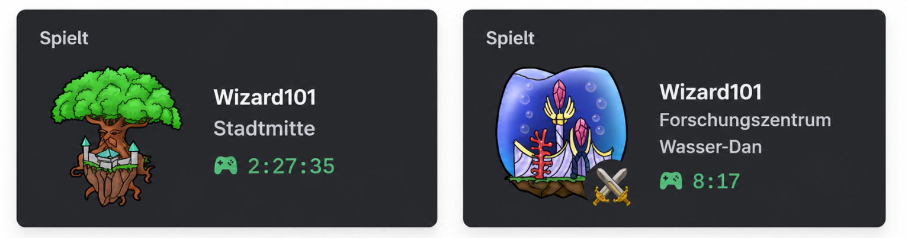

<strong>Meet Corvin, your little companion for Wizard101</strong>

Corvin quietly follows your adventures through the Spiral and keeps your Discord Rich Presence up to date with where you are and what you're doing.

No interaction required — start Corvin, launch Wizard101, and let him do the rest.

 

> **Note:** Currently only available in German.

---

<h2>👀 Preview</h2>

  

---

## ✨ Features

### 🎮 Discord Rich Presence

Corvin automatically reflects your current game state on Discord.

Currently displayed:

- Current world and area
- Roaming or combat status
- Character selection
- World-specific artwork

### 🌍 Localized Game Data

World and zone information is loaded from the separate **corvin-data** repository.

Corvin:

- Downloads world and zone data only when needed
- Uses German translations
- Caches visited worlds for the current session
- Reuses cached data when you return to a world

---

## 🚧 Planned

### 🪄 In-Game Overlay

A lightweight Windows overlay is planned to provide useful information without leaving the game.

Planned features include:

- Current combat round
- Active buffs and debuffs
- Enemy drop information
- Cheat and mechanic information

### 🌐 Multi-Language Support

Support for additional languages is planned, allowing Corvin's game data and Rich Presence to match your preferred language.

---

## 🖥️ Supported Platforms

- Windows

---

## 📂 Game Data

Game data is **not bundled** with Corvin.

World metadata, zone information and translations are downloaded as needed from the separate **ravendex-data** repository.

Loaded worlds are kept in memory for the duration of the session, avoiding unnecessary network requests.

---

## 🛡️ Windows Security Notice

Corvin is currently **not code signed**.

Because of this, Windows SmartScreen or Microsoft Defender may display a warning when downloading or launching the application.

This does not necessarily indicate that Corvin is malicious — unsigned applications from unknown publishers can trigger these warnings.

The complete source code is available in this repository for transparency.

---

## 🔒 Privacy

Corvin processes Wizard101 log data locally.

Network communication is limited to:

- Discord Rich Presence
- Downloading game data from ravendex-data

No user account is required.

---

## 📄 License

MIT License

> Corvin101 is an independent community project and is not affiliated with KingsIsle Entertainment or Wizard101.